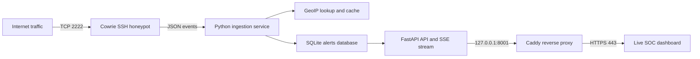

# Cowrie Honeypot SOC Platform

[](https://www.python.org/)
[](https://fastapi.tiangolo.com/)
[](https://cloud.google.com/compute)
[](#testing)

A production-style cloud security project that captures real internet SSH activity with [Cowrie](https://github.com/cowrie/cowrie), enriches the telemetry with geographic context, persists it in SQLite, and streams new events to a live SOC dashboard.

**Public dashboard:** [https://honeypot.greglabs.nl/](https://honeypot.greglabs.nl/)

> The dashboard displays genuine connection attempts received by Cowrie. A successful Cowrie login means an attacker entered the simulated honeypot environment; it does **not** mean the Google Cloud host was compromised.

## Project highlights

- Captures SSH connections, authentication attempts, commands, client versions, session state, and disconnect events.
- Preserves every login attempt in a dedicated audit table, including repeated credentials within the same session.
- Enriches public source IPs with country, city, latitude, and longitude while caching lookups.
- Updates the dashboard in near real time through Server-Sent Events (SSE).
- Visualizes unique sources on an interactive Leaflet map and provides operational statistics, credential trends, country/IP leaderboards, and a bounded live feed.
- Runs Cowrie, ingestion, FastAPI, and Caddy as independently supervised systemd services.
- Keeps SQLite and the application private while exposing only the honeypot listener and HTTPS dashboard.
- Uses no Gmail or Telegram integrations; captured telemetry remains in the database and dashboard.

## Architecture



### Data flow

1. Cowrie listens for untrusted SSH traffic on public port `2222` and writes structured JSON events.
2. `cowrie_to_sqlite.py` follows the log, handles rotation, enriches source IPs, and stores normalized telemetry.
3. FastAPI reads the live database and exposes dashboard, event, statistics, health, and SSE endpoints.
4. The browser loads recent history over HTTP and receives only newly recorded events over SSE.
5. Caddy terminates TLS and proxies requests to the private FastAPI listener.

## Telemetry captured

The platform records fields relevant to investigation and threat analysis:

- Event type, timestamp, Cowrie session ID, and connection status
- Source IP address and source port
- Country, city, latitude, and longitude
- Attempted username and password
- SSH client/version message
- Commands entered inside the simulated shell
- Successful and failed Cowrie authentication counts
- New connections, closed sessions, unique IPs, and total activity

Attacker-supplied data is untrusted. The dashboard renders it as text, and real personal credentials must never be used when testing the honeypot.

## Dashboard and API

### Public dashboard vs. operator dashboard

The project intentionally provides two different dashboard views:

| View | Audience | Data shown |
| --- | --- | --- |
| [Public dashboard](https://honeypot.greglabs.nl/) | Portfolio visitors and observers | Live metrics, geographic source map, country/IP trends, event categories, and a redacted connection feed. |
| Operator dashboard | The system administrator | Full operational telemetry, including attempted credential trends and command/session context. It must be access-restricted in a production deployment. |

The public Vercel frontend reads the live API with an exact CORS allow-list and has a bundled historical fallback. It deliberately does **not** show attempted usernames, passwords, entered commands, session identifiers, or raw messages. Attempted credentials may contain reused or leaked personal data, so they are operational intelligence for the administrator rather than public content.

The public dashboard uses a bright, accessible visual treatment and includes a custom tab icon. It is still live: new redacted Cowrie events are received through the SSE stream when the backend is available.

| Endpoint | Purpose |
| --- | --- |
| `/` | Live operator SOC dashboard |
| `/map` | Dashboard-compatible map route |
| `/events` | Recent normalized events, redacted for the public dashboard |
| `/stats` | Aggregated session, authentication, and source statistics; public responses exclude credential leaderboards |
| `/stream` | SSE stream containing newly persisted redacted events |
| `/health` | Database, ingestion-file, and application health information |

The dashboard includes:

- SSH sessions, unique sources, leading country, and latest-connection KPIs
- Global source map with one marker per unique IP
- Live connection and authentication feed
- Attempted credential visibility
- New, successful, failed, and closed-session status labels
- Top source IPs, countries, usernames, and passwords
- Command and client-message telemetry

## Security design

This deployment separates the intentionally exposed honeypot from the management and application surfaces:

- Cowrie runs as an unprivileged `cowrie` user and is isolated from the host's administrative SSH service.
- Administrative SSH uses key authentication, disables root/password login, and is restricted to Google Cloud IAP ingress.
- Google Cloud firewall rules expose only TCP `2222`, `80`, and `443` to the internet.
- Uvicorn listens only on `127.0.0.1:8001`; SQLite has no network listener.
- Caddy provides HTTPS, compression, reverse proxying, and baseline response-security headers.
- systemd units use `NoNewPrivileges`, private temporary storage, filesystem protection, and narrow write paths.
- Configuration is supplied through an ignored `.env` file; `.env.example` contains paths and safe defaults only.

The honeypot must remain isolated from production networks and sensitive workloads.

## Repository structure

```text
.
|-- deploy/gcp/
|   |-- install_services.sh       # Installs the ingestion and dashboard services
|   `-- publish_dashboard.sh      # Configures Caddy and public HTTPS
|-- honeypot-scripts/
|   `-- cowrie_to_sqlite.py       # Log follower, enrichment, and persistence
|-- honeypot-web/
|   |-- fastapi_app.py            # API, statistics, health, and SSE
|   `-- templates/dashboard.html  # Live SOC dashboard
|-- static-dashboard/             # Public Vercel frontend and tab icon
|-- tests/
|   |-- test_dashboard.py
|   `-- test_ingestion.py
|-- .env.example
`-- requirements-runtime.txt
```

## Local development

### Requirements

- Python 3.11+
- A Cowrie JSON log for live ingestion (optional for UI/API development)

### Setup on Windows PowerShell

```powershell
git clone https://github.com/Learnlife001/Honeypot.git
Set-Location Honeypot
python -m venv .venv
.\.venv\Scripts\python.exe -m pip install -r requirements-runtime.txt
Copy-Item .env.example .env
```

Update `.env` so `COWRIE_JSON_LOG`, `ALERTS_DB_PATH`, and `INGEST_STATE_FILE` point to local writable paths. Then start the dashboard:

```powershell
Set-Location honeypot-web
..\.venv\Scripts\python.exe -m uvicorn fastapi_app:app --host 127.0.0.1 --port 8001
```

Open [http://127.0.0.1:8001](http://127.0.0.1:8001).

To ingest a live Cowrie log, run this from a second terminal after configuring `.env`:

```powershell
.\.venv\Scripts\python.exe honeypot-scripts\cowrie_to_sqlite.py
```

## Google Cloud deployment

The live environment uses an Ubuntu 24.04 Compute Engine VM. Cowrie must already be installed and writing its JSON log before installing the application services.

```bash
sudo git clone https://github.com/Learnlife001/Honeypot.git /opt/honeypot
sudo bash /opt/honeypot/deploy/gcp/install_services.sh
sudo bash /opt/honeypot/deploy/gcp/publish_dashboard.sh
```

The service installer creates a Python virtual environment, a protected `.env`, persistent data paths, and hardened systemd units. The publishing script installs Caddy, derives an `sslip.io` hostname from the VM's public IP, and enables HTTPS.

For a long-lived deployment, reserve a static external IP. If an ephemeral VM address changes, the generated `sslip.io` dashboard hostname changes as well.

### Operations

```bash
# Service health
sudo systemctl status cowrie honeypot-ingest honeypot-dashboard caddy

# Follow ingestion logs
sudo journalctl -u honeypot-ingest.service -f

# Verify local API health
curl --fail http://127.0.0.1:8001/health

# Update the deployed application
sudo git -C /opt/honeypot pull --ff-only origin main
sudo systemctl restart honeypot-ingest.service honeypot-dashboard.service
```

## Testing

```powershell
.\.venv\Scripts\python.exe -m unittest discover -s tests -v
.\.venv\Scripts\python.exe -m py_compile honeypot-web\fastapi_app.py honeypot-scripts\cowrie_to_sqlite.py
```

The tests cover dashboard statistics and ingestion behavior, including preservation of repeated Cowrie login attempts.

## Technology stack

- **Cloud:** Google Cloud Compute Engine, VPC firewall rules, IAP
- **Security telemetry:** Cowrie SSH/Telnet honeypot
- **Backend:** Python, FastAPI, Uvicorn, Server-Sent Events
- **Data:** SQLite, WAL mode, GeoIP enrichment and caching
- **Frontend:** HTML, CSS, JavaScript, Leaflet
- **Operations:** Linux, systemd, Caddy, TLS, UFW, Fail2ban

## Responsible use

This repository is intended for defensive security research, education, and portfolio demonstration. Deploy honeypots only on infrastructure you own or are authorized to operate. Do not connect them to sensitive networks, reuse real credentials, or treat captured attacker input as trusted data.

## License

See [LICENSE](LICENSE).
